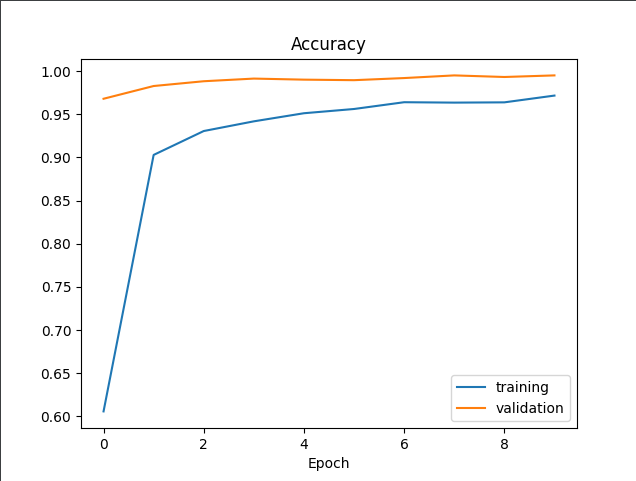
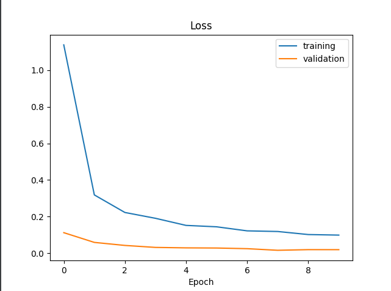

# Text detection using CNN :

### Programs:
1. The file main.py creates the model and save it using the functions in the cnn_training.py
2. The file text_detection.py uses the computer camera so the user can give the image of a number and the model will predict it in real time
### Accuracy :

### Loss :
